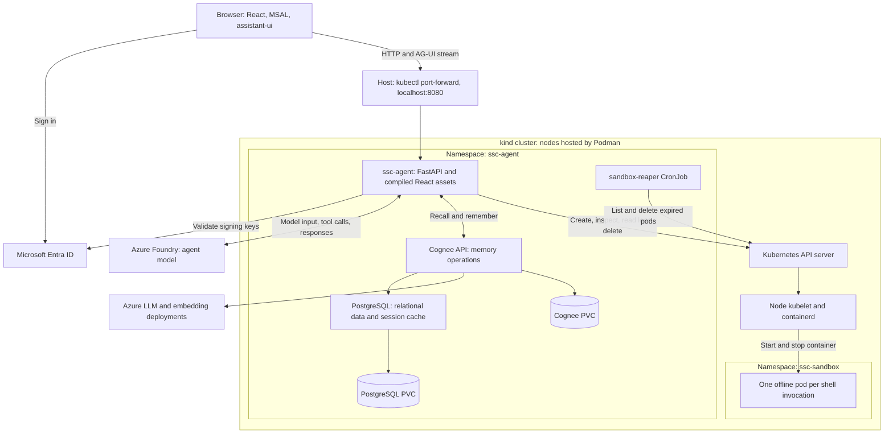
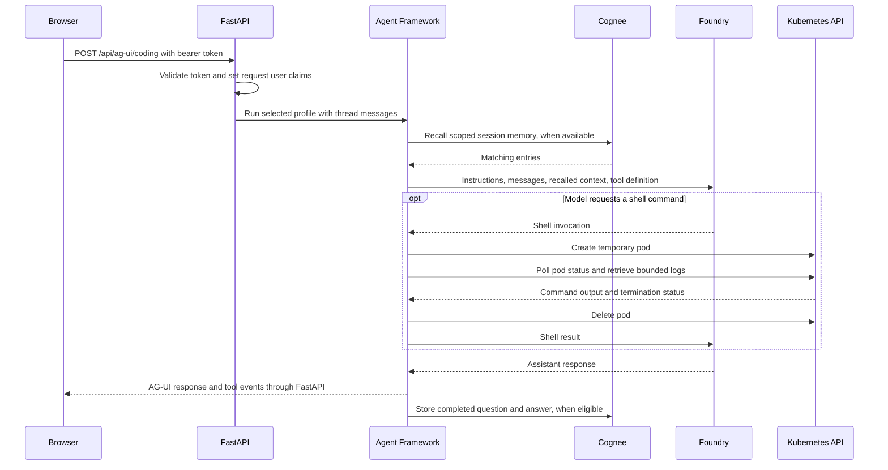

# How SSC Agent works

This guide follows the implementation in this repository: a React interface,
a FastAPI agent backend, Cognee memory, PostgreSQL, and temporary Kubernetes
shell pods. Use the [deployment runbook](kubernetes.md) for commands and the
[architecture overview](architecture.md) for a shorter introduction.

## 1. Where each component runs

Podman builds the two application images and hosts the kind node containers.
Inside those nodes, Kubernetes schedules workloads and containerd runs their
containers. Azure hosts the models. The browser runs the React application.
Moving workloads to kind does not remove container images from the system.



The arrows to the sandbox represent Kubernetes control operations. The shell
process cannot call the API, Cognee, Foundry, DNS, or the internet. The backend
retrieves its output through Kubernetes logs.

| Component | Location | Responsibility |
| --- | --- | --- |
| React application | Browser; static files served by FastAPI | Sign-in, chat rendering, agent selection, connection test |
| `ssc-agent` Deployment | `ssc-agent`, port 8080 | HTTP API, authentication, agent orchestration, shell adapter |
| `cognee` Deployment | `ssc-agent`, port 8000 | Recall and store conversation memory through its remote SDK/API |
| `postgres` StatefulSet | `ssc-agent`, port 5432 | Cognee relational database and PostgreSQL-backed cache |
| Shell pods | `ssc-sandbox` | Execute one command invocation using the .NET 8 SDK image |
| `sandbox-reaper` CronJob | `ssc-agent` | Recover from interrupted cleanup or backend crashes |
| `kube-network-policies` DaemonSet | `kube-system` | Enforce Kubernetes network policies on each node |
| Offline seccomp profile | Each eligible kind node | Block network socket creation inside sandbox processes |

The deployment defines internal Services and uses port forwarding for browser
access. It does not create an Ingress or configure an existing Contour instance.
There is no separate frontend server or Cognee UI workload.

## 2. From browser sign-in to an answer

The entry point in [main.tsx](../frontend/src/main.tsx) initializes MSAL, handles
the sign-in redirect, selects an account, and mounts authentication, query, and
router providers. `AuthGate` shows the login screen, then a connection-test screen,
then the workspace. MSAL uses browser session storage; the frontend also holds
the latest ID token in a module variable.

The workspace in [App.tsx](../frontend/src/App.tsx) creates an AG-UI `HttpAgent`
for the selected agent. `authenticatedFetch` attaches the bearer token. Both the
AG-UI client and generated ordinary HTTP clients use that authentication helper.
`assistant-ui` and its AG-UI adapter manage the displayed conversation and stream.



The diagram shows the logical flow. Streaming can overlap execution; persistence
is an after-run hook, not a separate browser request. A run can contain multiple
tool invocations. Each invocation creates its own pod, even within one answer.

| Route | Authentication | What it does |
| --- | --- | --- |
| `GET /` and static assets | Public | Serve the compiled SPA; browser authentication controls workspace access |
| `GET /health` | Public | Return API process health and version |
| `GET /openapi/v1.json` | Public | Publish the ordinary HTTP API contract |
| `POST /api/test-agent` | Bearer token | Call a dedicated Foundry test agent without shell or memory providers |
| `POST /api/ag-ui/ssc-agent` | Bearer token | Stream the general agent through AG-UI |
| `POST /api/ag-ui/coding` | Bearer token | Stream the coding profile through AG-UI |
| `POST /api/chat` | Bearer token | Legacy JSON request/response path through the general agent |

The two profiles share a Foundry client, shell adapter, and Cognee client inside
one backend process. The coding profile adds software-engineering instructions;
it is not a different model deployment. Profile registration happens while
[main.py](../backend/src/ssc_agent/main.py) registers the endpoints. The first
actual model request exercises Azure connectivity.

## 3. The four authentication relationships

| Caller and destination | Credential | Configuration owner |
| --- | --- | --- |
| Browser to FastAPI | Entra bearer token, normally the SPA ID token | Frontend `VITE_MSAL_*`; backend `MSAL_TENANT_ID` |
| FastAPI to Foundry | `DefaultAzureCredential`; supplied service principal in kind | Backend `AZURE_CLIENT_ID`, `AZURE_TENANT_ID`, `AZURE_CLIENT_SECRET` |
| Cognee to Azure models | Azure resource API keys | Cognee `LLM_API_KEY` and `EMBEDDING_API_KEY` |
| Backend/reaper to Kubernetes | Projected service-account token and cluster CA | ServiceAccount, Role, and RoleBinding manifests |

Browser sign-in does not authenticate the backend to Foundry. The browser never
receives Azure service-principal secrets, Cognee resource keys, or Kubernetes
credentials. Host `az login` credentials are not mounted into the deployment.

[auth.py](../backend/src/ssc_agent/auth.py) accepts RS256 JWTs, selects an Entra
signing key by `kid`, and checks issuer, expiry, issued-at requirements, and tenant.
Signing keys are cached for one hour. The current tenant-only implementation
disables audience verification and does not require API scopes, roles, or a
particular SPA client. This is current development behavior, not a configurable
production authentication mode.

The dependency clears and then populates a `ContextVar` with the current user's
claims. The memory provider reads this context to derive its durable session key.
The sandbox receives no user bearer token or application secrets.

## 4. Conversation state and durable memory

Three kinds of state have different lifetimes:

| State | Owner | Lifetime |
| --- | --- | --- |
| Visible conversation and selected agent | Browser AG-UI/React runtime | Current runtime; switching agents remounts it, and New conversation reloads the page |
| Legacy `AgentSession` objects | Backend `_sessions` dictionary | One backend process; lost on restart |
| Remembered question/answer entries | Cognee and its storage | Survive app and Cognee pod replacement while PVCs remain |

There is no implemented saved-conversation list or browser history-restoration
API. Durable recall can supply useful context when a session is reused, but it
does not itself restore the chat interface after a reload.

### Memory key and recall

[memory.py](../backend/src/ssc_agent/memory.py) chooses the authenticated `oid`,
falling back to `sub`, and hashes it. It hashes `AgentSession.session_id` separately.
The resulting key has this shape:

```text
ssc:<first 24 hex characters of principal SHA-256>:shared:<first 24 hex characters of session SHA-256>
```

The AG-UI adapter uses its thread ID as `AgentSession.session_id`. Memory work is
skipped if the provider has no session ID, no suitable user claim, or no user text.
Both profiles currently use the `shared` key namespace. Their provider source IDs
differ, but those IDs do not partition Cognee storage by profile.

Before a run, the provider gathers user input text and initializes the Cognee SDK
in remote mode with `cognee.serve(url=..., api_key=...)`. It calls `cognee.recall`
with `SearchType.CHUNKS`, `scope="session"`, the scoped key, and `top_k` (default 5).
Returned entries are formatted into at most 12,000 characters of extra agent
instructions. This keeps memory context bounded independently of shell output.

After a run, a nonempty question and final answer are stored using
`cognee.remember(QAEntry(...), dataset_name=..., session_id=...)`. Recall or storage
exceptions are logged and do not prevent the agent response. `COGNEE_TIMEOUT`
exists as a setting but is not currently passed to this SDK wrapper or enforced
with a separate timeout; it should not be treated as a guaranteed deadline.

### Legacy session behavior

`/api/chat` uses the caller's `sessionId` only as a dictionary lookup key and
creates `AgentSession()` without explicitly assigning that ID. Thus the Cognee
key uses the framework-generated session ID, not the literal HTTP `sessionId`.
A backend restart loses that mapping. The dictionary key is also not qualified
by user, so durable memory's user hashing must not be mistaken for user isolation
of every legacy in-memory session object. AG-UI is the primary UI path.

### What PostgreSQL stores

Cognee is configured with `DB_PROVIDER=postgres` and `CACHE_BACKEND=postgres`.
Its database and cache connect to the `postgres` Service. The pgvector-capable
PostgreSQL image alone does not configure every vector or graph store to use
PostgreSQL; those providers retain Cognee defaults unless explicitly changed.
Cognee's system and data directories live on its separate PVC.

Cognee uses its own LLM and embedding settings, independent of the chat agent's
`FOUNDRY_MODEL`. Defaults are `azure/gpt-4.1-mini` and
`azure/text-embedding-3-small`, with 1536 embedding dimensions. The local deployment
disables Cognee backend access control and relies on the application to scope
memory requests. Setting an API key alone does not provision Cognee users or
convert this into a fully configured multi-tenant Cognee deployment.

## 5. A shell invocation, step by step

The model sees `run_shell` through `FoundryChatClient.get_shell_tool`.
[kubernetes_shell.py](../backend/src/ssc_agent/kubernetes_shell.py) executes the
function with `approval_mode="never_require"`; this application does not prompt
the user to approve each command.

1. Acquire a backend semaphore slot. The default limit is four active invocations
   across both agent profiles in that process.
2. Generate a name such as `shell-<uuid>` and track it for cleanup.
3. POST a Pod object to `/api/v1/namespaces/ssc-sandbox/pods`.
4. Kubernetes schedules it on a node labeled `ssc-agent.local/offline-sandbox=true`.
   The node pulls the image if it is missing, then starts the container with the
   offline seccomp profile already active.
5. Execute `/usr/bin/timeout --signal=KILL <seconds> /bin/sh -c <command>` in the workspace directory (default `/workspace`).
6. Poll the Pod API every 0.5 seconds until the pod succeeds or fails.
7. Read the shell container's termination status and up to 65,536 bytes of logs.
   Return a text result containing its exit code and combined stdout/stderr.
8. In a `finally` block, request pod deletion with zero grace period. Deletion is
   shielded from ordinary request cancellation; failures are logged for reaping.

The adapter uses HTTPS through the Kubernetes API, verifies the mounted cluster
CA, and rereads the projected token for each request to support token rotation.
It needs neither a local kubeconfig nor `kubectl`, Podman, or `pods/exec` access.
There is no fallback to host execution when Kubernetes is unavailable.

### Time and resource limits

| Limit | Default | Meaning |
| --- | --- | --- |
| Command execution | 30 s | GNU timeout begins inside the running container |
| Startup allowance | 120 s | Added to the pod and client execution budget; not an independent startup-only timer |
| Pod `activeDeadlineSeconds` | 150 s | `ceil(startup allowance + command timeout)` |
| Client timeout block | 165 s | Startup allowance + command timeout + 15 s |
| Individual HTTP request timeout | 15 s | Kubernetes API request timeout |
| CPU | 100m request, 1 CPU limit | Scheduling reservation and execution limit |
| Memory | 128 MiB request, 512 MiB limit | Scheduling reservation and container memory limit |
| Ephemeral storage | 256 MiB limit | Pod container/log storage budget |
| `/tmp` | 128 MiB `emptyDir` size limit | Writable temporary storage |
| Workspace | 5 GiB `workspace-storage` PVC | Shared persistent space for code and build artifacts |
| Output | Up to 64 KiB | From the beginning of the log; no live subprocess-output stream |
| Namespace quota | 16 pods; 2 CPU/2 GiB requests; 16 CPU/8 GiB limits | Aggregate sandbox workload budget |

Waiting for a semaphore slot occurs before the client timeout block; deletion
also occurs afterward. The 165-second default is therefore not a hard bound on
total time from tool submission to return. Exit code 137 can result from the
configured kill timeout or other kills such as an out-of-memory condition; it is
not by itself proof of one particular cause.

### Shared workspace and execution environment

The default image is `mcr.microsoft.com/dotnet/sdk:8.0`. It supplies the .NET 8 SDK,
`/bin/sh`, and GNU timeout. The working directory is the shared workspace (mounted at
`/workspace` by default), while `HOME` and `DOTNET_CLI_HOME` are `/tmp`.
Files in the workspace persist across tool calls and pod invocations, allowing the
agent service (via `write_file`, `read_file`, `list_files`, `delete_file`) and the sandbox
to collaborate on creating, building, running, and testing code projects.

## 6. Why the sandbox is offline

Two independent mechanisms are configured:

| Mechanism | Where enforced | Effect |
| --- | --- | --- |
| Namespace `deny-all` NetworkPolicy | Node network-policy controller | Denies ingress and egress for all sandbox pods |
| `ssc-offline.json` seccomp profile | Container runtime/kernel | Allows socket creation only for `AF_UNIX`; denies IPv4, IPv6, packet, and netlink sockets |

Live migration testing observed connections succeeding immediately after pod
startup before the network policy applied. Seccomp closes that startup window
because it is installed before the command executes. It also blocks IP loopback.
The profile retains the captured containerd default-deny syscall policy and does
not allow `socketcall` or `io_uring` as alternatives. Its current architecture
list supports amd64 and its x86 compatibility ABIs; the helper rejects other node
architectures.

The helper writes the profile under `/var/lib/kubelet/seccomp/ssc-offline.json`
inside each kind node, then labels the node. Missing labels leave sandbox pods
unscheduled; missing profile files prevent their containers from starting.
Adding or replacing nodes requires installing the profile again. The label alone
does not contain or distribute the profile.

Additional pod controls are non-root UID/GID 10001, dropped Linux capabilities,
no privilege escalation, a read-only root filesystem, no mounted service-account
token, and no injected Kubernetes Service environment variables. Only the shell
pods get the offline profile; the app and reaper need Kubernetes/Azure networking.
Image pulls happen on the node and are not shell network access.

| Service account | Namespace where permissions apply | Allowed operations |
| --- | --- | --- |
| `ssc-agent` in `ssc-agent` | `ssc-sandbox` | Create/get/delete pods; get pod logs |
| `sandbox-reaper` in `ssc-agent` | `ssc-sandbox` | List/delete pods |
| Shell pod | No token mounted | No authenticated Kubernetes access supplied |

Both application namespaces enforce the restricted Pod Security standard.
The network controller itself runs privileged in `kube-system` for node-level
network enforcement. Pod isolation still shares the node kernel. Per-pod process
count limits belong to kubelet configuration; the manifests do not reproduce the
former Podman 256-process limit.

## 7. Cleanup after failures

| Situation | Immediate behavior | Recovery |
| --- | --- | --- |
| Command finishes or exits nonzero | Read logs/exit code; delete pod | None normally needed |
| GNU command timeout | Kill command; report terminal status | Delete pod |
| Pod fails before a shell exit status exists | Return the pod failure reason | Delete pod |
| Client timeout | Return sandbox timeout text | Delete pod |
| Cancellation reaches the adapter | Propagate cancellation after cleanup attempt | Deadline/reaper cover failed cleanup |
| Kubernetes API request fails | Return unavailable/uncertain-execution text | Attempt deletion even if creation response was lost |
| Backend process crashes | In-process cleanup cannot run | Pod deadline stops execution; CronJob removes stale pod objects |

The reaper uses the application image and runs
`python -m ssc_agent.kubernetes_shell` every two minutes. It lists pods labeled
`app.kubernetes.io/managed-by=ssc-sandbox` and deletes those whose age exceeds
their declared deadline plus 120 seconds. With the default deadline, eligibility
starts after 270 seconds, with deletion at a subsequent successful scheduled run.

It runs outside the offline namespace, has its own service account, and avoids
concurrent reaper Jobs. Each Job has a 60-second deadline, one retry, and a
300-second finished-Job TTL. This TTL cleans up the reaper's Jobs; it is not the
cleanup mechanism for plain sandbox pods. A stopped/unhealthy cluster delays
both scheduling and cleanup.

## 8. Configuration from files to running processes

The deployment helper imports the root `.env` explicitly. It applies namespace
and RBAC resources, then default ConfigMaps, then allowlisted overrides and a
Secret, before applying workloads. This order lets initial database startup see
the intended credentials and database name.

| Configuration | Consumer | How it reaches the consumer |
| --- | --- | --- |
| `FOUNDRY_PROJECT_ENDPOINT`, `FOUNDRY_MODEL` | Agent backend | `ssc-agent-config` environment |
| `AZURE_CLIENT_*`, `AZURE_TENANT_ID` | Agent backend | Explicit keys from `ssc-agent-secrets` |
| `MSAL_TENANT_ID`, `CORS_ALLOWED_ORIGINS` | FastAPI | Backend ConfigMap environment |
| `COGNEE_*` | Memory client | Backend ConfigMap; optional API key from Secret |
| `LLM_*`, `EMBEDDING_*` | Cognee server | Cognee ConfigMap plus resource keys from Secret |
| `POSTGRES_USER`, `POSTGRES_DB` | PostgreSQL and Cognee | PostgreSQL settings mapped to Cognee `DB_USERNAME`/`DB_NAME` |
| `POSTGRES_PASSWORD` | PostgreSQL and Cognee | Shared Secret key, named `DB_PASSWORD` in Cognee |
| `KUBERNETES_SHELL_*` | Shell adapter | Backend ConfigMap environment |
| `VITE_MSAL_*`, `VITE_API_BASE_URL` | Browser bundle | Vite build/development environment, not pod runtime environment |

[configure_kind.py](../scripts/configure_kind.py) only overrides keys already
present in the three ConfigMaps. It preserves internal `COGNEE_URL`, `DB_HOST`,
`DB_PORT`, and the sandbox namespace. It maps
`COGNEE_ENABLE_BACKEND_ACCESS_CONTROL` to Cognee's
`ENABLE_BACKEND_ACCESS_CONTROL`. Unknown and legacy Podman/shell keys are ignored.

Some Python settings therefore need a manifest change before `.env` can override
them through this helper: for example, `FOUNDRY_INSTRUCTIONS` is not currently in
the backend ConfigMap. The reaper's namespace and RBAC are also fixed in manifests;
changing only an application namespace setting is insufficient to relocate pods.

Secret values are passed to kubectl on stdin, with server-side apply, rather than
saved in generated YAML or command arguments. The workloads receive individual
secret keys. Settings loaded into process environment are refreshed by pod
replacement, not by editing `.env` alone. The helper explicitly restarts the app
and Cognee; it does not automatically rotate an initialized PostgreSQL password.

### Frontend build-time settings

Vite's `envDir: '..'` lets local `pnpm dev` and `pnpm build` read the root `.env`.
The container build excludes `.env*` and currently defines no `VITE_*` build
arguments. Consequently, changing root `.env` or a runtime ConfigMap does not
customize MSAL settings in the container-built frontend; it uses source defaults
unless the frontend build wiring is explicitly changed. Never pass server-side
secrets into a Vite bundle.

The UI's displayed model name is also a source string in `App.tsx`. The actual
model comes from backend `FOUNDRY_MODEL`, so the display is not a live configuration
readout. The Activity log page is currently a placeholder, not a durable tool log.

## 9. Build, deploy, and storage lifecycle

The deployment scripts ([deploy-kind.ps1](../scripts/deploy-kind.ps1) for Windows PowerShell and [deploy-kind.sh](../scripts/deploy-kind.sh) for macOS/Linux Bash) target an existing cluster using the explicit context `kind-<Cluster>` and perform these steps:

1. Check access and build app/Cognee images with Podman unless `-SkipBuild` / `--skip-build` is set.
2. Install the offline seccomp profile on amd64 or arm64/aarch64 kind nodes and label them.
3. Export image archives, load them into kind, then remove the temporary archives.
4. Apply the network-policy controller and wait for its rollout.
5. Apply namespaces/RBAC, default ConfigMaps, and imported configuration/Secrets.
6. Apply workloads; restart app/Cognee; wait for PostgreSQL, Cognee, and app readiness.
7. Execute live sandbox smoke checks from the application pod.
8. Print the port-forward command. The helper does not start that forwarding process.

The root [Containerfile](../Containerfile) builds React with Node/pnpm, installs
the locked backend dependencies with uv, and combines both in a non-root Python
runtime. FastAPI serves the SPA through `FRONTEND_DIST=/app/frontend-dist`.
[Cognee's Containerfile](../cognee/Containerfile) builds its separate Python
environment and starts its API through `entrypoint.sh`.

Images use `localhost/...:dev` and `IfNotPresent`. Those tags are local names, not
a configured registry. Loading the rebuilt image into kind and replacing the pod
are both necessary for an update. Restarting a pod alone does not rebuild code.

| Workload/storage | Kubernetes arrangement | Replacement behavior |
| --- | --- | --- |
| App | One-replica Deployment, `Recreate`, no PVC | Brief downtime; in-process state is lost |
| Cognee | One-replica Deployment, `Recreate`, 5 GiB `cognee-storage` PVC | System/data files persist |
| PostgreSQL | One-replica StatefulSet, 5 GiB `data-postgres-0` PVC | Database persists; `PGDATA` is `/var/lib/postgresql/data/pgdata` |
| Sandbox | Plain Pod, `restartPolicy: Never`, `/tmp` emptyDir | Files disappear when pod is deleted |

Cognee mounts `/cognee-storage`; its image places system data in `system/` and
data files in `data/`. PostgreSQL has a headless internal Service. Cognee's init
container waits for `pg_isready` before starting its API. The app does not wait
for Cognee before serving HTTP, consistent with memory failures being tolerated.

Both application Deployments use HTTP startup/readiness/liveness probes.
PostgreSQL uses `pg_isready`. App `/health` reports process health only; a green
probe does not prove Azure credentials, memory storage, or shell permissions work.
The manifests use the cluster's default storage class. The supplied kind setup
uses local-path storage; deleting its node/cluster is not a data-preserving backup
strategy. No backup or restore automation is included.

## 10. Validation and source map

| Check | Evidence it provides | What it does not prove |
| --- | --- | --- |
| Backend pytest suite | API/auth logic, mocked memory calls, sandbox lifecycle and cleanup behavior | Real cloud credentials or node networking |
| Frontend build/lint | Type/build and lint checks | Authenticated browser behavior |
| Playwright smoke test | Unauthenticated sign-in UI | Full signed-in chat workflow |
| `/health` | HTTP process responds | Foundry, memory, or shell availability |
| `/api/test-agent` after browser sign-in | Entra request accepted and Foundry test agent responds | Shell execution or durable memory |
| `scripts/smoke_kind.py` | Real pods, .NET execution, filesystem isolation, timeouts, cancellation, network denial, deletion | Browser authentication, model-driven tool selection, or Cognee persistence |

The live sandbox test reaches the API, DNS TCP port, and `1.1.1.1:443` from the
ordinary app pod first, then verifies denial from an offline pod. It uses the
application image's Python for precise socket probes and the default SDK image
for command checks. This control prevents general loss of connectivity from
being mistaken for isolation. Custom sandbox images or networks that intentionally
block those control targets require corresponding test changes.

| File | Start here when changing |
| --- | --- |
| [frontend/src/App.tsx](../frontend/src/App.tsx) | Chat runtime, profile selector, workspace |
| [frontend/src/api-mutator.ts](../frontend/src/api-mutator.ts) | HTTP authentication helper |
| [backend/src/ssc_agent/main.py](../backend/src/ssc_agent/main.py) | Routes, endpoint registration, static serving, shutdown |
| [backend/src/ssc_agent/auth.py](../backend/src/ssc_agent/auth.py) | Token validation and request identity |
| [backend/src/ssc_agent/agent_service.py](../backend/src/ssc_agent/agent_service.py) | Agent profiles, model client, legacy sessions |
| [backend/src/ssc_agent/memory.py](../backend/src/ssc_agent/memory.py) | Durable session keys and Cognee hooks |
| [backend/src/ssc_agent/kubernetes_shell.py](../backend/src/ssc_agent/kubernetes_shell.py) | Pod specification, execution, cleanup and reaper |
| [backend/src/ssc_agent/config.py](../backend/src/ssc_agent/config.py) | Python defaults and validation |
| [deploy/kind/configmaps.yaml](../deploy/kind/configmaps.yaml) | Deployment configuration defaults |
| [deploy/kind/workloads.yaml](../deploy/kind/workloads.yaml) | Services, workloads, probes and volumes |
| [deploy/kind/namespaces-rbac.yaml](../deploy/kind/namespaces-rbac.yaml) | Namespaces, permissions, policy and quota |
| [deploy/kind/seccomp-offline.json](../deploy/kind/seccomp-offline.json) | Offline syscall profile |
| [scripts/deploy-kind.ps1](../scripts/deploy-kind.ps1) | Deployment order and image loading on Windows (PowerShell) |
| [scripts/deploy-kind.sh](../scripts/deploy-kind.sh) | Deployment order and image loading on macOS / Linux (Bash) |
| [scripts/configure_kind.py](../scripts/configure_kind.py) | `.env` import rules and Secret application |

For operational commands and failure diagnosis, continue with the
[kind deployment runbook](kubernetes.md).
